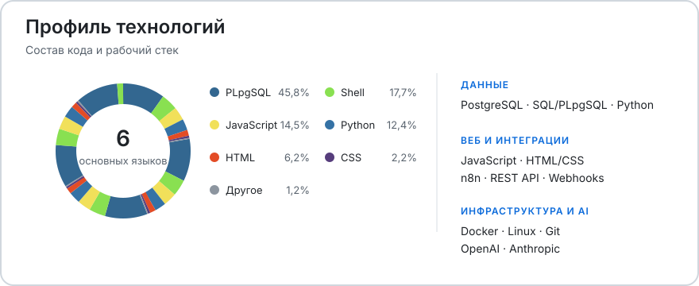

  <h1>Привет, я Артем</h1>

  
<strong>Автоматизация процессов · цифровые решения · AI и API-интеграции</strong>

  

    Соединяю опыт управления операционными процессами 
    с разработкой понятных и практичных цифровых решений.
  

## // Обо мне

Разбираю реальные процессы, нахожу потери и превращаю повторяющиеся операции в понятные цифровые решения.

- **Процессы и эффективность:** реинжиниринг, Lean, DMAIC, SIPOC, BPMN, стандартизация и управленческая отчётность.
- **Автоматизация и интеграции:** RPA, ERP, no-code/low-code, API и обмен данными между сервисами.
- **Веб- и AI-решения:** сайты, чат-боты, CRM, сервисы онлайн-записи и мультимодельные AI-сценарии.

## // Как работаю

`процесс → причина потерь → MVP → проверка на живой задаче → масштабирование`

Начинаю с одной измеримой задачи, передаю владельцу понятную систему и учитываю требования к размещению персональных данных.

## // Технологии и инструменты

<picture>
  <source media="(prefers-color-scheme: dark)" srcset="./assets/profile-tech-dark.svg">
  <source media="(prefers-color-scheme: light)" srcset="./assets/profile-tech-light.svg">
  
</picture>

## // Проекты

### [CROND](https://crond.ru)

Проект по автоматизации процессов малого и среднего бизнеса: от анализа задачи до внедрения понятного цифрового решения.
